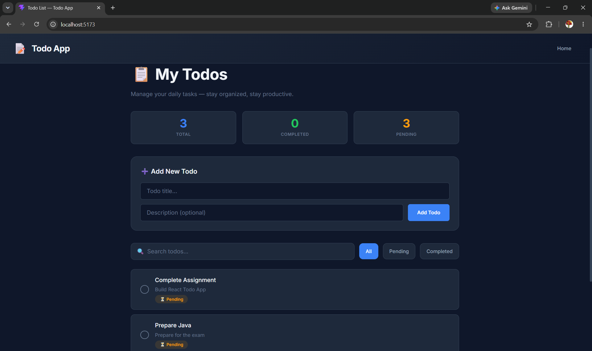
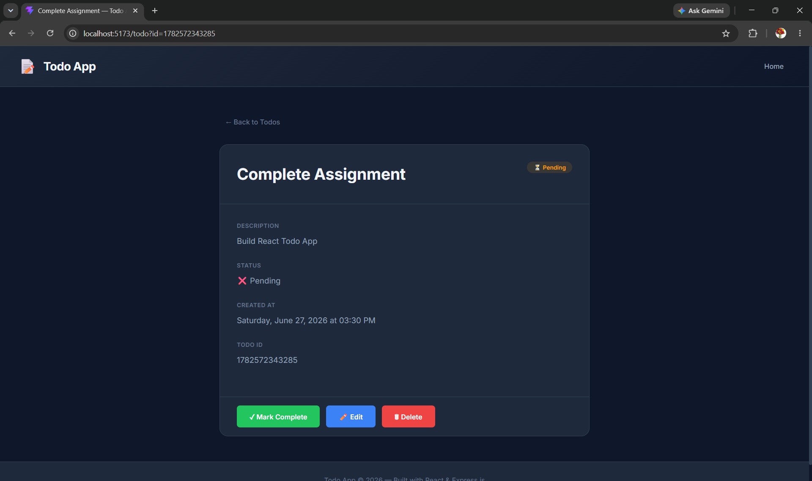
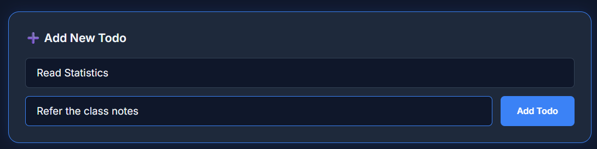
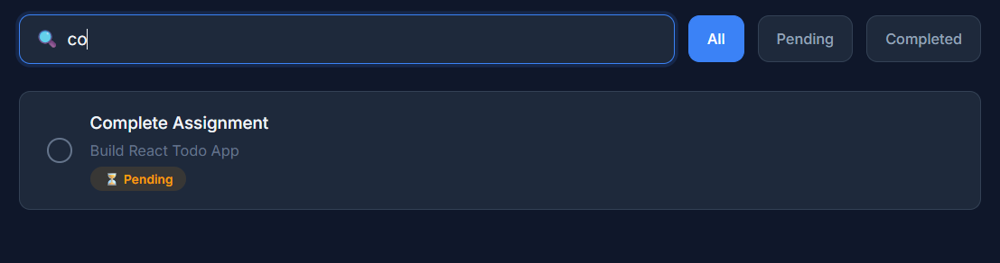

# 📝 Full Stack Todo Application

A modern **Full Stack Todo Application** built with **React**, **Node.js**, and **Express.js**. Manage your daily tasks effortlessly with a sleek dark-themed UI and complete CRUD (Create, Read, Update, Delete) functionality.

---

## 🚀 Features

### Backend

- Node.js application with Express.js
- CRUD APIs for Todos (Create, Read, Update, Delete)
- Data stored in a local JSON file (`todos.json`)
- Error handling using try-catch
- CORS enabled for frontend communication

### Frontend

- React (multi-page application using React Router — not a SPA)
- Built with Vite for fast development
- Axios for API communication
- **Page 1 — Todo List:** View all todos, add new todos, edit todo title and description, mark as Completed/Pending, delete todos, search by title, and view statistics (Total, Completed, Pending)
- **Page 2 — Todo Details:** Receives a todo ID as a query parameter (`/todo?id=<id>`) and displays the full details of that individual todo including title, description, status, created date, and todo ID
- Responsive and modern dark-themed UI

---

## 🛠 Tech Stack

### Frontend

| Technology       | Version |
| ---------------- | ------- |
| React            | 19.2    |
| Vite             | 8.1     |
| React Router DOM | 7.18    |
| Axios            | 1.18    |

### Backend

| Technology | Version |
| ---------- | ------- |
| Node.js    | —       |
| Express.js | 5.2     |
| Nodemon    | 3.1     |

### Data Storage

- JSON File (`todos.json`)

---

## 📁 Project Structure

```text
todo-app/
│
├── backend/
│   ├── controllers/
│   │   └── todoController.js
│   ├── routes/
│   │   └── todoRoutes.js
│   ├── data/
│   │   └── todos.json
│   ├── server.js
│   └── package.json
│
├── frontend/
│   ├── src/
│   │   ├── components/
│   │   │   ├── Navbar.jsx
│   │   │   ├── Footer.jsx
│   │   │   └── TodoCard.jsx
│   │   │
│   │   ├── pages/
│   │   │   ├── TodoList.jsx
│   │   │   └── TodoDetails.jsx
│   │   │
│   │   ├── services/
│   │   │   └── api.js
│   │   │
│   │   ├── App.jsx
│   │   ├── main.jsx
│   │   └── index.css
│   │
│   ├── index.html
│   ├── vite.config.js
│   └── package.json
│
├── .gitignore
└── README.md
```

---

## ⚙️ Installation

### Clone the Repository

```bash
git clone <repository-url>
cd todo-app
```

---

### Backend Setup

```bash
cd backend
npm install
npm run dev
```

Backend runs at:

```
http://localhost:5000
```

---

### Frontend Setup

Open a new terminal:

```bash
cd frontend
npm install
npm run dev
```

Frontend runs at:

```
http://localhost:5173
```

---

## 📌 API Endpoints

| Method   | Endpoint     | Description       |
| -------- | ------------ | ----------------- |
| `GET`    | `/todos`     | Get all todos     |
| `GET`    | `/todos/:id` | Get a todo by ID  |
| `POST`   | `/todos`     | Create a new todo |
| `PUT`    | `/todos/:id` | Update a todo     |
| `DELETE` | `/todos/:id` | Delete a todo     |

---

## 📷 Screenshots

### Todo List Page



### Todo Details Page



### Add Todo Form



### Search and Filter Page



---

## 🎯 Future Improvements

- 🔐 User Authentication
- 🗄️ MongoDB Database Integration
- 📅 Due Dates for Todos
- 🔺 Priority Levels
- 🏷️ Categories & Tags
- ✋ Drag and Drop Task Management
- 🌗 Dark / Light Theme Toggle
- 🔔 Notification Reminders

---

